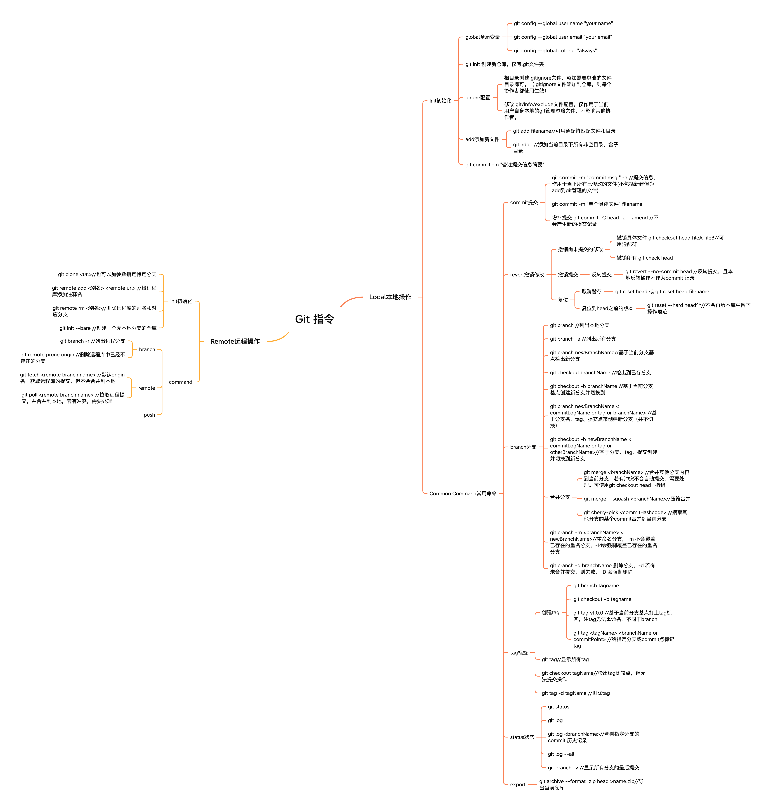
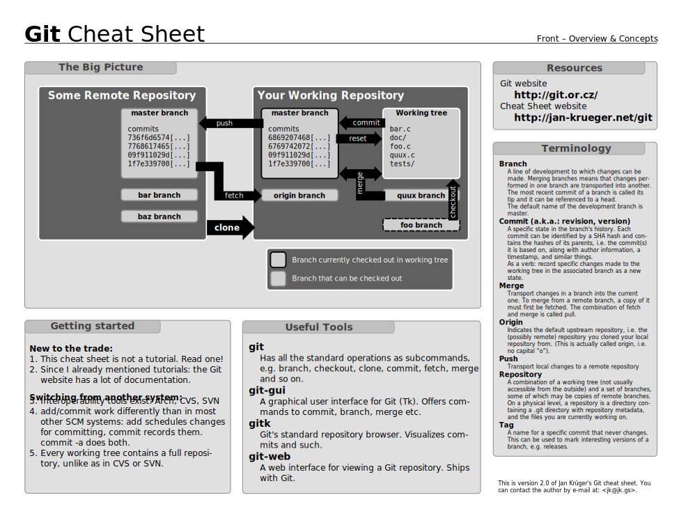
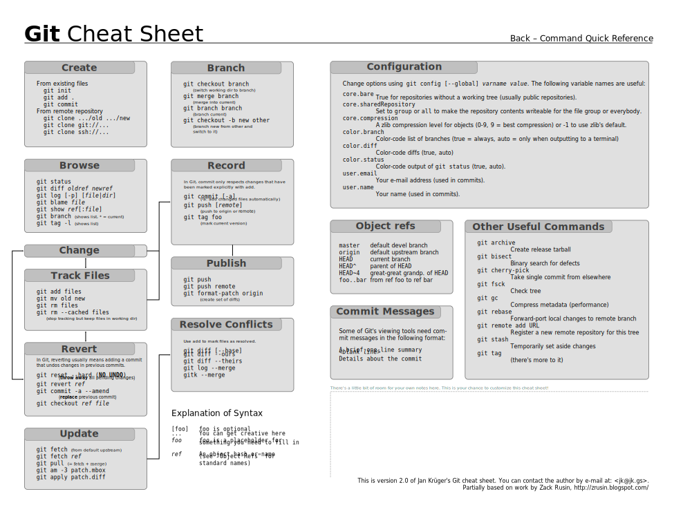

# Git 指令

## Local本地操作

### Init初始化

- global全局变量

	- git config --global user.name "your name"
	- git config --global user.email "your email"
	- git config --global color.ui "always"

- git init 创建新仓库，仅有.git文件夹
- ignore配置

	- 根目录创建.gitignore文件，添加需要忽略的文件目录即可。（.gitignore文件添加到仓库，则每个协作者都使用生效）
	- 修改.git/info/exclude文件配置，仅作用于当前用户自身本地的git管理忽略文件，不影响其他协作者。

- add添加新文件

	- git add filename//可用通配符匹配文件和目录
	- git add . //添加当前目录下所有非空目录，含子目录

- git commit -m "备注提交信息简要"

### Common Command常用命令

- commit提交

	- git commit -m "commit msg " -a //提交信息，作用于当下所有已修改的文件(不包括新建但为add到git管理的文件)
	- git commit -m "单个具体文件" filename
	- 增补提交 git commit -C head -a --amend //不会产生新的提交记录

- revert撤销修改

	- 撤销尚未提交的修改

		- 撤销具体文件 git checkout head fileA fileB//可用通配符
		- 撤销所有 git check head .

	- 撤销提交

		- 反转提交

			- git revert --no-commit head //反转提交，且本地反转操作不作为commit 记录

	- 复位

		- 取消暂存

			- git reset head 或 git reset head filename

		- 复位到head之前的版本

			- git reset --hard head^^//不会再版本库中留下操作痕迹

- branch分支

	- git branch //列出本地分支
	- git branch -a //列出所有分支
	- git branch newBranchName//基于当前分支基点检出新分支
	- git checkout branchName //检出到已存分支
	- git checkout -b branchName //基于当前分支基点创建新分支并切换到
	- git branch newBranchName <commitLogName or tag or branchName> //基于分支名、tag、提交点来创建新分支（并不切换）
	- git checkout -b newBranchName <commitLogName or tag or otherBranchName>//基于分支、tag、提交创建并切换到新分支
	- 合并分支

		- git merge <branchName> //合并其他分支内容到当前分支，若有冲突不会自动提交，需要处理。可使用git checkout head . 撤销
		- git merge --squash <branchName>//压缩合并
		- git cherry-pick <commitHashcode> //摘取其他分支的某个commit合并到当前分支

	- git branch -m <branchName> <newBranchName>//重命名分支，-m 不会覆盖已存在的重名分支，-M会强制覆盖已存在的重名分支
	- git branch -d branchName 删除分支，-d 若有未合并提交，则失败，-D 会强制删除

- tag标签

	- 创建tag

		- git branch tagname
		- git checkout -b tagname
		- git tag v1.0.0 //基于当前分支基点打上tag标签，注tag无法重命名，不同于branch
		- git tag <tagName> <branchName or commitPoint> //给指定分支或commit点标记tag

	- git tag//显示所有tag
	- git checkout tagName//检出tag比较点，但无法提交操作
	- git tag -d tagName //删除tag

- status状态

	- git status
	- git log
	- git log <branchName>//查看指定分支的commit 历史记录
	- git log --all
	- git branch -v //显示所有分支的最后提交

- export

	- git archive --format=zip head >name.zip//导出当前仓库

## Remote远程操作

### init初始化

- git clone <url>//也可以加参数指定特定分支
- git remote add <别名> <remote url> //给远程库添加注释名
- git remote rm <别名>//删除远程库的别名和对应分支
- git init --bare //创建一个无本地分支的仓库

### command

- branch

	- git branch -r //列出远程分支
	- git remote prune origin //删除远程库中已经不存在的分支

- remote

	- git fetch <remote branch name> //默认origin名，获取远程库的提交，但不会合并到本地
	- git pull <remote branch name> //拉取远程提交，并合并到本地，若有冲突，需要处理

- push

### 附录

