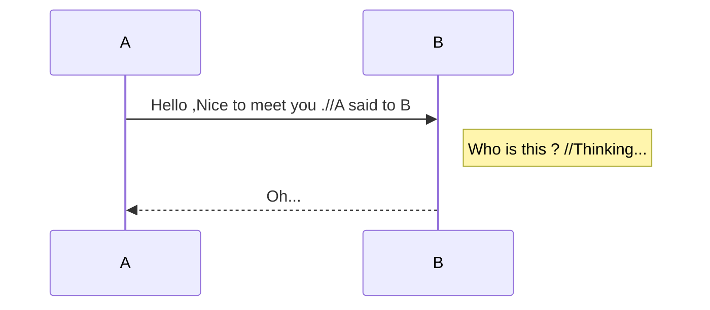
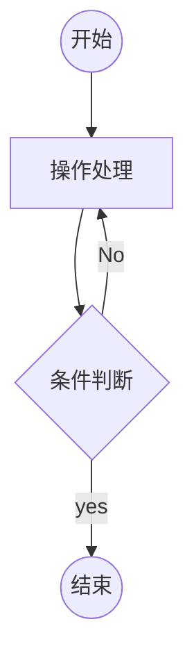

# Markdown简明语法

***声明***：**markdown编辑器不同，会略有差异**。标准语法中**标签符号**与**正文**之间需有空格，或一致的缩进，或空行，才有效果。

[TOC]

1、目录，行首使用`[TOC]`标签，会将所有**标题**属性的文本添加在目录中。

2、标题，行首，有`#`形式的atx语法风格，和两个以上`=`或`-`形式的setext风格。`#`支持1--6级标题，分别使用1--6个`#`符号。而setext风格似乎只能一个级别的标题。

- 源码`# 一级标题`，效果：

# 一级标题

## 二级标题

###### 六级标题

- 源码：

> settext标题
>
> ==

# Setext标题

3、引用块，行首使用`>`符号

> 如此，引用名人名言，或者段落说明，当然也可以层级嵌套
>
> > You Never Know What You Can Do Until You Try !
>
> 不同的Markdown编辑器显示的这些风格也是略有不同。

4、分割线，行首使用`---`、`___`或`***`，三个或以上，加、减或下划线符号。

------

5、段内代码区块，或者当作背景框，使用`` ` `` 一对反引号包括。

- 源码``  `This is a code block` ``，效果：`This is a code block`
- 有时候需要特定显示`` ` `` 反引号，可以用````````两个的反引号成对的包括，三个、四个的也可以。

6、代码区域，行首使用的是三个反引号```````shell ````包裹代码区域，并注明编程语言，可实现代码识别和高亮。

- 示例：

```shell
#shell语法
ls
echo abc;
```

```java
//Java语法
public static void main(String[] args){
  // do something
}
```

7、列表，行首使用`+`、`-`、`*`符号+空格，接文本。有序列表使用`1.`，数字+`.`符号，而数字不必按照顺序。

- 无序第一条
- 无序第二条

1. 有序第一条
2. 有序第二条

8、链接，自动链接网址或邮箱的标准格式，

- 如www.baidu.com或admin@abc.com。
- 行内式，`[Name](url,"Title")`，如[百度](www.baidu.com,"打开搜索")
- 参考式，`[Name][id]`，用于大量引用链接时候的批量管理，需要在文末适当位置，注明`id`，格式`[id]:url` 如[Google][g]，[g]:http://www.google.com

9、强调，使用成对的`*`或`_`包裹文本，单个标识斜体，两个是加粗，三个是粗斜体。`~~`波浪线标识删除线。

- 示例：*斜体*，**粗体**，***粗斜体***，~~删除线~~ 
- 下划线需要`<u>`标签，<u>下划线</u>
- `==`高亮，==高亮符号==

10、`$`符号，Latex数学公式的标识,高级语法需要单独学习Latex

- 示例，一对`$`包裹，$What is this ?$
- 两对`$$`，会居中$$These are double $ sign $$
- 三对`$$$`,也挺特别$$$Three $ sign in this code. $$$


- 在`$`符号包裹内的文本，配合特定符号，会有不同效果

示例：

1. 上标`$A^b$`，效果$A^b$
2. 下标`$A_b$`，效果$A_b$
3. %百分号会忽略掉之后文字，`$ABC%abc$`，效果$ABC%abc$

==示例，数学公式：==

- 行内公式，`$\Gamma(n)=(n-1)!\quad\forall n\in\mathbb N$`

$\Gamma(n)=(n-1)!\quad\forall n\in\mathbb N$

- 块级公式，`$$x=\dfrac{-b\pm\sqrt{b^2-4ac}}{2a}$$`

$$x=\dfrac{-b\pm\sqrt{b^2-4ac}}{2a}$$

`\` 转义符号，依旧在Markdown语法中有用。

11、图片，类似于链接

- 行内式,，格式`![title]`(url)	,如 ： - 参考式，```![name][id]```，在需要的地方配置`[id]:imagePath`,
- 如(**typora**支持，但csdn不支持该格式),![摩托2][motor]
[motor]:https://img-blog.csdnimg.cn/fdd7a83d853a4188b3fe070087152402.jpeg

- **好像id不可以是数字哦**

12、表格，行首开始，`|`号分割列，`-`标识对齐方式。至少有表头才能行程表格。

| 左对齐     |     右对齐 |  居中对齐   |
| :--------- | ---------: | :---------: |
| 使用`:---` | 使用`---:` | 使用`:---:` |

默认`---`为左对齐

13、复选框，使用`+`、`-`、`*` 加`[ ]`符号，其中`[ ]`中间为空格，则表示未选择，为`x`表示选择

- [ ] Hi！

- [ ] Hello.

- [x] 你好

14、表情符号，使用`:`一对冒号中间加对应表情编码，参照[Emoji](http://emoji.codes)

- `:aries:`,:aries:，星星，:stars:

15、脚注，格式`[^id]`，如China[^1] ，文末处注解。

16、流程、序列图

- 简单序列图，使用```mermaid sequenceDiagram ```,



- 简单流程图,使用```mermaid flowchat```




- flow形式的流程图语法

```flow
st=>start: 开始
ed=>end: 结束
op=>operation: 操作处理
cond=>condition: 确认与否
comp=>inputoutput: 输入输出

st->op->cond
cond(yes)->ed
cond(no)->comp(top)->op
```

- 甘特图，有的编辑器可直接使用```gantt```，有的则需要在```mermaid```中

```mermaid
gantt
	title 项目甘特图 ##标题
	section  项目确定 #项目阶段
		需求分析	:a1,2022-12-20,3d # 任务名称，日期线和时长
		可行性评估	:after a1,5d //可行性评估
		概念验证	:5d
	section 项目实施
		概要设计	:2023-01-10,5d
		详细设计	:2023-01-15,3d
		编码		:2023-01-19,6d
		测试		:2023-01-25,2d
	section 发布验收
		发布		:2d
		验收		:2d
```

更多的图表语法，可查看[Mermaid](https://mermaidjs.github.io/)
<font color="#ff0000">注：本文使用的是**Typora**编辑器，有些语法特性，CSDN不一定支持。墙裂推荐使用**Typora**！</font>

[^1]:注解，Markdown、AsciiDoc，Latex都挺专业的文字排版工具。
