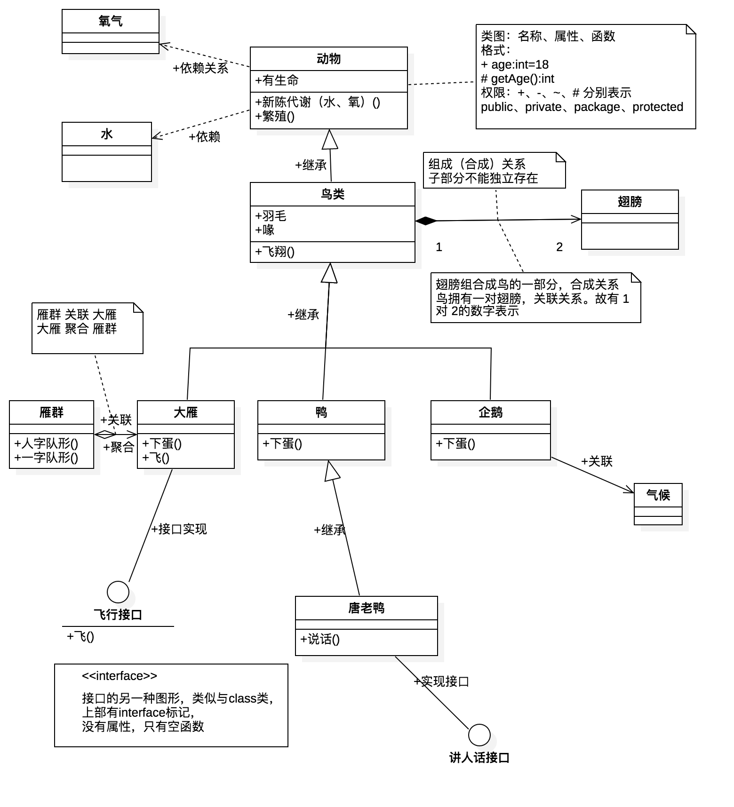

## 一张图简述UML类图

> UML建模常用视图中，类图可算是最多的，初学UML的类图绘制，基于starUML工具，现简记如下

#### 一、类图组件

1. 类、接口

   类图中，类的表示如图所示，有三部分：

   - 类名称
   - 属性：格式为 `权限 名称:类型 [=默认值]`  \[ ] 表示可选的意思
   - 函数：格式为 `权限 函数名（参数） ：[ 返回类型 ]`

   权限：`+、-、#、～`分别对应`public、private、protected、default`

   接口，类似于类图的表示，名称上有`<<interface>>`这个标记。或者用 `圆圈⭕️`表示

2. 关系线

   - 继承，使用 `无尾 实线 空三角箭头`
   - 接口实现，使用`无尾 虚线 空三角箭头`，注，如用 `圆圈`表示接口，则只是一条实线表示实现关系
   - 关联，`无尾 实线 大于号箭头`
   - 依赖，`无尾 虚线 大于号箭头`
   - 聚合，`空心棱形 实线`，聚合关系，个体可独立
   - 组合，`实心棱形 实线`组合关系，组成部分不能独立

