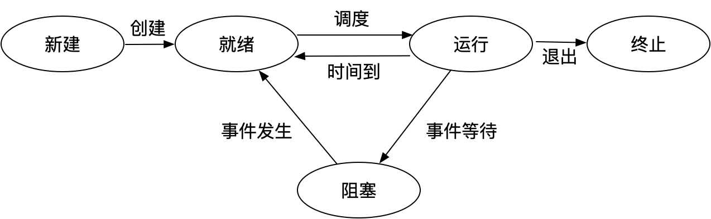
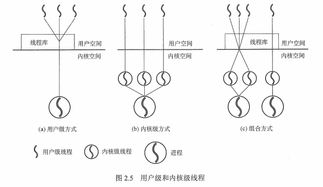
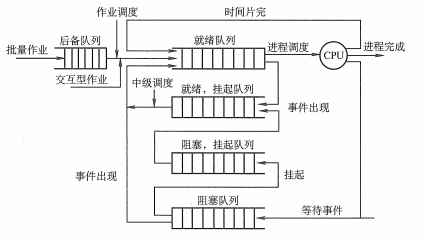

## 进程管理

### 一、进程与线程

#### 1.1 进程的概念和特征

更好地描述和控制程序并发执行，实现操作系统的**并发性**和**共享性**。

进程控制块（**PCB**）：更好的描述进程的基本情况和运行状态，进而控制和管理进程。是**进程存在的唯一标志**。

组成（构成进程映像（进程实体））：

- 进程控制块（**PCB**）：数据结构，描述进程的基本情况和运行状态，是进程存在的唯一标志。
- 程序段：能被`进程调度程序`调度到**CPU**运行的程序的代码段。
- 数据段：存储程序运行期间的相关数据。

**进程是一个动态的、过程性的概念。**

进程的特征：

- 动态性：进程的实质是程序在多道程序系统中的一次执行过程，进程是动态产生，动态消亡的。
- 并发性：任何进程都可以同其他进程一起并发执行。
- 独立性：进程是一个能独立运行的基本单位，同时也是操作系统分配资源和调度的独立单位。
- 异步性：由于进程间的相互制约，使进程具有执行的间断性，即进程按各自独立的、不可预知的速度向前推进。
- 结构性：**程序段**、**数据段**和**进程控制块**三部分组成。

#### 1.2 进程的状态与转换

| 描述                 | 进程状态                                                     |
| -------------------- | ------------------------------------------------------------ |
| 创建状态             | 进程正在被创建，还没有就绪                                   |
| 就绪状态             | 进程已获取了出处理器之外的一切所有资源（只需获取时间片就可工作） |
| 运行状态             | 进程已在处理器运行                                           |
| 阻塞状态（等待状态） | 进程正在等待某一事件而暂停（出现**I/O**或服务请求）          |
| 结束状态             | 进程正从系统中消失，分为正常结束、异常结束                   |




```shell
就绪状态-->运行状态：处理器调度，得到处理及资源。
运行状态-->就绪状态：时间片用完或有更高级的程序进入。
运行状态-->阻塞状态：进程正在等待某一事件而暂停（某一资源还未准备好）。
阻塞状态-->运行状态：进程需要的资源已经准备好。
```

#### 1.3 进程的控制

把进程控制的程序叫做原语（运行期间不可中断，是不可切割的基本单位）

进程的控制：在进程生存期间，对其全部行为的控制。典型的控制行为有创建进程、阻塞进程、唤醒进程、撤销进程。

> 进程的创建：终端用户登录系统、作业调度、系统提供服务、用户程序的应用请求。（fork进程）
>
> 进程的终止：正常结束、异常、外界干预。
>
> 进程的阻塞：进程等待资源（时间片/IO等）
>
> 进程的唤醒：等待之资源就绪
>
> 进程的切换：处理器从一个进程运行到另一个进程，如时间片耗尽、放弃处理器占用。

#### 1.4 进程的通信

- 低级通信（**PV**操作）：是一种实现进程互斥与同步的有效方法。**PV**操作与信号量处理相关，**P**通过，**V**释放。

- 高级通信：共享存储、消息传递、管道通信

  > ##### 1.4.1 共享存储
  >
  > 相互通讯的进程有共享存储区，进程间可以通过直接读写共享存储区的变量来交互数据，同步与互斥在并发程序设计时安排进入程序。操作系统提供这样的共享存储区及同步互斥工具。
  >
  > ##### 1.4.2 消息传递
  >
  > 通过操作系统的相应系统调用进行消息传递通讯，分为两种
  >
  > - 直接通讯方式：点到点发送，即进程在发送和接收消息时直接指明接收着活发送者的进程ID
  > - 间接通讯方式：以**信箱**为媒介进行传递，可以广播（系统为每个信箱设一个消息队列，消息发送和接收都指向该消息队列）
  >
  > ##### 1.4.3 管道通信（利用pipe文件）
  >
  > 管道是一种信息流缓冲机构，**UNIX**系统中管道基于文件系统，在内核中通过文件描述符表示。管道以先进先出**FIFO**方式组织数据传输。
  >
  > 特点：
  >
  > 1. 管道是一个单项通信信道，若进程间需要双向通信，通常需要两个管道。
  > 2. 管道通过系统调用`read()`,`write()`函数进行读写。
  >
  > 分类：
  >
  > - 匿名管道：只适用于父子进程之间通信；能够把信息从一个进程的地址空间拷贝道另一进程的地址空间。
  > - 命名管道：管道有自己的名字和访问权限限制，类似于文件。可用于不相关进程间通信，通过名字获取管道。

#### 1.5 线程的概念及多线程模型

- 目的：减小程序在并发时所付出的时空开销，提高操作系统的并发性能。

- 解释：轻量级的进程，是一个基本的**CPU**执行单元，是**程序执行流的最小单元**。

- 引入线程的变化：

  - 资源分配及调度

    1. 传统进程机制中，进程是资源分配/调度的基本单元。
    2. 引入线程后**进程是资源分配的基本单元，线程是调度的基本单元**。

  - 并发性

    1. 传统进程机制，只能进程间并发
    2. 引入线程后，线程间并发，提高系统并发度。

  - 系统开销

    - 传统进程间并发，需要切换进程，耗费资源。
    - 线程间并发，同一进程间的线程切换，相对系统开销较小。

  - 线程属性：轻型实体、独立调度和分配的基本单元、可并发执行、共享进程资源

  - 线程实现方式

    - 用户级线程（**ULT**）：所有工作由应用程序完成
    - 内核级线程（**KLT**）：内核支持的线程，所有工作由系统内核完成。

    

  - 多线程模型

    - 多对一模型：多个用户级线程映射到一个内核级模型
    - 一对一模型：一个用户级线程映射到一个内核级模型
    - 多对多模型：`n`个用户级线程映射到`m`个内核级模型，`n>=m`

### 二、 处理器调度

#### 2.1 调度的概念

处理器调度是按照一定的算法对处理器进行分配。是多道操作系统的基础，是操作系统设计的核心问题。

#### 2.2 调度的层次

- 作业调度（高级调度）：内存与外存的调度，对于每个作业仅调入一次、调出一次。多道批处理系统中大多配有作业调度，而其他系统中通常不需配置作业调度，作业调度执行**频率较低**且**时间较长**，通常为几分钟一次。
- 内存调度（中级调度）：目的是为了提高内存利用率和系统吞吐量。内存调度将那些暂时不能运行的进程调至外存等待，把进程状态挂起。当**挂起态**的进程能够运行且内存空闲，则重新调入内存修改为**就绪态**，在就绪队列等待。
- 进程调度（低级调度）：按照某种方法策略从就绪态队列中取进程，分配处理器执行。是最基本的调度，执行**频率高，时间短**，一般几十毫秒一次。

#### 2.3 三级调度的联系

1. 作业调度为进程活动做准备，进程调度使进程正常活动起来。
2. 内存调度将暂时不能运行的进程挂起，内存调度处于作业调度和进程调度之间。
3. 作业调度次数最少，内存调度次数略多，进程调度频率最高。
4. 进程调度使最基本的，不可或缺。



#### 2.4 进程调度方式

- 剥夺式（抢占式）：有更为重要或紧迫的进程需要使用处理机，立即分配。
- 非剥夺式（非抢占式）：有更为重要或紧迫的进程需要使用处理机，仍让当前进程继续执行。

#### 2.5 调度的基本准则

> CPU利用率、系统吞吐量、周转时间、等待时间、响应时间

#### 2.6 典型的调度算法

> 1. 先来先服务（FCFS）：选择最先进入队列的进程
> 2. 短作业（SJF）：优先选择完成时间最短的进程
> 3. 优先级调度算法：根据进程优先级
> 4. 高响应比优先：选择响应比最高的进程优先调度
> 5. 时间片轮转：总是选择就绪队列中的第一个进程，但仅能运行一个时间片
> 6. 多级反馈队列调度算法：时间片轮转和优先级调度算法的综合使用。

### 三、进程同步

#### 3.1基本概念

##### 3.1.1 临界资源

> 临界资源：一次仅允许一个进程使用的资源（必须互斥进行）。
>
> 临界区：访问临界资源的代码。

##### 3.1.2 同步

> 直接制约关系，为完成任务的多个线程进程，需要协调他们的工作次序等待。

##### 3.1.3 互斥

> 间接制约关系，当一个进程使用临界资源，其他进程需要等待。

同步机制遵循以下准则：

1. 空闲等待
2. 忙则等待
3. 有限等待
4. 让权等待

#### 3.2 实现临界区互斥的方法

##### 3.2.1 软件实现

> - 单标志法（违背**空闲等待原**则）
>
>   - 该算法设置一个公用整型变量`turn`，用于指示被允许进入临界区的进程编号。如`turn=0`	则`p0`进程可进入临界区。
>   - 可确保每次仅一个进程进入临界区，但两个进程必须交换进入，若某个进程不再进入，另一个也将无法进入。如此违背**空闲让进**的原则，造成资源利用不充分。
>
> - 双标志法先检查（违背**忙则等待**原则）
>
>   进程访问临界区资源之前，先查看资源是否正被访问，若是则等待，否则进入。
>
>   设置数据`flag[i]`，若第`i`个元素`false`，则表示进程`pi`为进入，`true`表示进程`pi`已进入临界区。
>
> - 双标志法后检查（会导致饥饿现象）
>
>   先检查双标志法会存在两个进程同时检查对方标志后，再操作自身标识符，然后就出现同时进入临界区的问题。
>
>   所以该算法修改为先标记自身状态，再去检查对方标志，来确定是否进入。（所以也会有饥饿问题）
>
> - 皮特森算法**Peterson’s Algorithm** 
>
>   即单标志法和双标志法后检查 相结合
>
>   设置变量**turn**，进程设置自身标识后在设置**turn**值，然后去检测另一进程的状态标志，以此保证只允许一个进程进入临界区。

##### 3.2.2 硬件实现

计算机提供特殊硬件指令，允许对一个字中的内容进行检测和修正，或对两个字的内容进行交换等。

通过硬件支持实现临界区问题的方法，称为**元方法**

- 中断屏蔽方法

  当一个进程正使用处理机执行其临界代码时，防止其他进程再进入该临界区的最简单方法是，禁止一切中断发生。称之为屏蔽中断。

- 硬件指令方法

  设立原子操作指令，`TestAndSet`指令是**原子操作**，执行该代码时不允许被中断。其功能是读取标志后修改为`true`

- 信号量

  解决互斥和同步问题，只能被`wait(S)`和`signal(S)`访问。计作`P`操作、`V`操作。本身是一个计数器，使用`P`、`V`两个操作来实现计数的减加，当计数不大于`0`时，进程进入休眠态。用于多进程提供共享数据的访问。

#### 3.3 管程

管程是由 `局部于自己的`**若干公共变量及其说明**和`所有访问这些公共变量的过程`所组成的**软件模块**。

目的：

1. 将分散在各进程的临界区集中起来管理
2. 防止进程有意/无意的违法同步操作
3. 便于高级语言书写程序和正确性校验

### 四、死锁

#### 4.1 死锁概念

多进程因为**竞争资源**而造成的互相等待

#### 4.2 死锁产生的条件

1. **互斥**：进程获取到资源具有具有排他性
2. **不剥夺**：进程已获取的资源不可被中断剥夺
3. **请求保持**：当前进程已占用资源，且申请其他资源未果而受阻塞，但仍不释放已占资源
4. **循环等待**：死锁发生必然存在一个**进程——资源**的环形链，进程之间资源存在互相持有（或传递持有而闭环）的问题

#### 4.3 死锁的处理策略

##### 4.3.1 预防死锁

- 破坏互斥。但仍有场景存在互斥条件，如打印机。
- 破坏不剥夺条件，如此则增加系统开销，降低吞吐量。
- 破坏请求和保持条件，采用预先静态分配方法，一次性申请所有所需资源，造成系统资源浪费，还可能导致饥饿现象。
- 破坏循环等待，采用顺序分配方法，如此也浪费系统资源。

##### 4.3.2 避免死锁

1. 安全状态：分配资源序列，让进程顺序完成
2. 银行家算法，预分配策略检查分配完成时系统是否处于安全状态

##### 4.3.3 检测死锁

利用死锁定理，化简资源分配图，以检测死锁存在

##### 4.3.4 解除死锁

1. 资源剥夺法：挂起死锁的进程，让其他进程继续
2. 撤销进程法：强制撤销部分/全部，剥夺资源
3. 进程回退法：让一个或多个进程回到足以回避死锁的阶段

