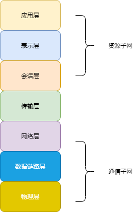

## 计算机网络概述

### 一、计算机网络的概念

计算机网络：是一个将`分散的`、`具有独立功能的`计算机系统，通过`通信设备`与`线路`连接起来，由功能完善的软件实现**资源共享**和**信息传递**的系统。

简单来说：计算机网络是互连的、自治计算机系统的集合。

### 二、计算机网络的功能

* **数据通信**
* **资源共享**
* 分布式处理
* 提高可靠性
* 负载均衡

### 三、计算机网络的组成

#### 3.1 按组成部分

* **硬件**：主机（端系统）、通信链路（光纤、双绞线）、交换设备（路由器、交换机）、通信处理机（网卡等）。
* **软件**：实现资源共享的软件以及方便用户使用的工具软件（聊天工具、FTP程序、网络操作系统、邮件收发程序）。
* **协议**：计算机网络的核心，规定网络传输数据遵守的规定。

#### 3.2 按工作方式

* 边缘部分：用户直接使用（C/S方式、P2P方式）。
* 核心部分：为边缘部分服务。

####  3.3 按功能组成

* 通信子网：各种传输介质、通信设备、相应的协议组成。
* 资源子网：实现资源共享的设备和软件集合。

 

### 四、计算机网络的分类

#### 4.1 按分布范围分类

* 广域网WAN：采用交换技术
* 城域网MAN
* 局域网LAN：采用广播技术
* 个人局域网PAN

#### 4.2 按使用者分类

* 公用网：中国电信、中国移动等
* 专用网：军队、电力、铁路

#### 4.3 按交换技术分类

* 电路交换
* 报文交换
* 分组交换

#### 4.4 按拓扑结构分类

* 总线型
* 星型
* 环型
* 网状型

#### 4.5 按传输技术分类

* 广播式网络：一台计算机发送报文，其他计算机都能听到（采用广播技术）
* 点对点网络：计算机通过直接或中间结点对分组进行接收、存储和转发直到目的地（采用存储转发机制）

### 五、计算机网络标准化工作及相关组织

#### 5.1 生成 RFC 过程

* 因特网草案
* 建议标准
* 草案标准
* 因特网标准

#### 5.2 国际组织

* 国际标准化组织（ISO）：OSI 参考模型、HDLC 协议
* 国际电信联盟（ITU）：远程通信标准
* 国际电气电子工程师协会（IEEE）：802标准、学术机构

### 六、计算机网络的性能指标

#### 6.1 速率

连接在计算机网络上的主机数字信道上传送数据位数的速率，单位：b/s(比特/每秒)、Mb/s、Gb/s、Tb/s。

#### 6.2 带宽

网络在通信线路中传送数据的能力，单位：b/s(比特/每秒)、kb/s、Mb/s、Gb/s、Tb/s。

#### 6.3 吞吐量

单位时间内通过某个网络的数据量，受网络带宽或网络额定速率的限制。

#### 6.4 时延

数据从网络的一端到另一端所需要的时间。

* 发送时延：发送分组的第一个比特开始，到最后一个比特发送结束的时间（分组长度/信道带宽）
* 传播时延：一个比特从链路一段到另一端需要的时间（信道长度/电磁波在信道上的传播速率）
* 处理时延：数据在交换结点为存储转发而进行的一些必要的处理所花费的时间。
* 排队时延：分组在进入路由器后，像排队一样等待被转发的时间。

#### 6.5 时延带宽积

发送端连续发送数据且发送的第一比特即将到达终点时，发送端已经发出的比特数（传播时延*带宽）

#### 6.6 往返时延RTT

从发送数据到接收到接收端的确认，经历的时延。

#### 6.7 利用率

* 信道利用率：有数据通过时间 / 总数据通过时间
* 网络利用率：信道利用率加权平均值

### 七、分层结构

* 实体：第n层中的活动元素称为n层实体，同一层的实体叫对等实体。
* 协议：为进行网络中的对等实体数据交换而建立的规则、标准或约定称为网络协议。
  - 语法：传输数据的格式
  - 语义：所要完成的功能
  - 同步：各种操作的顺序
* 接口（访问服务点SAP）：上层使用下层服务的入口。
* 服务：下层为相邻上层提供的功能调用。

SDU服务数据单元：为完成用户所要求的功能而应传送的数据。

PCI协议控制信息：控制协议操作的信息。

PDU协议数据单元：对等层次之间传送的数据单位。

### 八、OSI 参考模型

#### 8.1 物理层

* 传输单位：比特流

* 任务：透明传输的比特流

* 功能：物理媒体上为数据端设备透明的传输原始比特流；定义数据终端设置和数据通信设备的物理与逻辑连接方法；接口的机械形状和尺寸、交换电路的数量和排列

* 协议：EIA-232C、EIA/TIA RS-449

#### 8.2 数据链路层

- 传输单位：帧
- 任务：将网络层传来的IP数据报组装成帧
- 功能：成帧、差错控制（对传输中受到干扰的信号进行检错、并丢弃）、流量控制（控制对方的速度）、传输管理
- 协议：HDLC、SDLC、PPP

#### 8.3 网络层

* 传输单位：数据报
* 任务：把网络层协议数据单元（分组）从源端传到目的端，为分组交换网上的不同主机提供通信服务
* 功能：流量控制、拥塞控制（对网络中因为来不及接收导致大量丢失的情况，采取措施对拥塞进行缓解）、差错控制、网际互连（将大量异构网络通过路由器相互连接起来）
* 协议：IP

#### 8.4 传输层

- 传输单位：报文段（TCP）、用户数据报（UDP）
- 任务：主机之间两个进程的相互通信
- 功能：端到端通信、流量控制、差错控制、服务质量、数据传输管理等服务
- 协议：TCP、UDP

#### 8.5 会话层

- 任务：允许不同主机各个进程之间的进行通话
- 功能：建立会话同步 、管理主机间的会话进程

#### 8.6 表示层

- 任务：处理两个通信系统中交换信息的表示方式
- 功能：数据压缩、加密和解密、数据表示交换

#### 8.7 应用层

- 任务：用户与网络的界面，为特定类型的网络应用提供访问OSI环境的手段
- 协议：FTP、SMTP、HTTP

### 九、TCP/IP 模型

#### 9.1 应用层

对应 OSI 的会话层、表示层、应用层

#### 9.2 传输层

对应 OSI 的传输层

* 传输控制协议（TCP）：面向连接（可靠交付）、数据传输的基本单位是报文段
* 用户数据报协议（UDP）：无连接（不可靠交付）、数据传输的基本单位用户数据报

#### 9.3 网际层

对应 OSI 的网络层

#### 9.4 网络接口层

对应 OSI的数据链路层和物理层

指出主机必须使用的某种协议与网络连接

### 十、五层参考模型

| 层次       | 简述                                       |
| ---------- | ------------------------------------------ |
| 应用层     | 支持各种网络应用（FTP、SMTP、HTTP）        |
| 传输层     | 进程-进程的数据传输（TCP、UDP）            |
| 网络层     | 源主机到目的主机的数据分组路由与转发（IP） |
| 数据链路层 | 把网络传下来的数据报封装成帧（PPP）        |
| 物理层     | 比特传输                                   |

