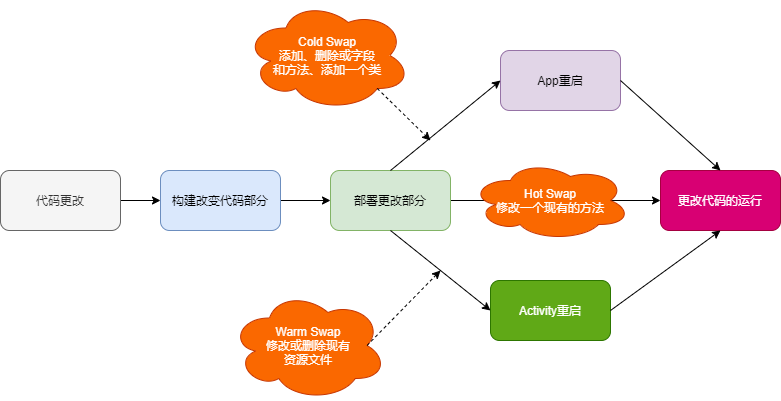
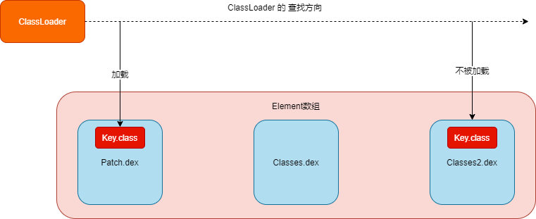

## 1 热修复核心

* 资源修复
* 代码修复
* 动态链接库修复

## 2 资源修复

资源修复参考 **Instant Run** 的资源修复原理。

* 创建 AssetManager，通过反射调用 addAssetPath 方法加载外部的的资源。
* 将 AssetManager 类型的 mAssets 字段的引用全部替换成新创建的 AssetManager。

### 2.1 Instant Run

Instant Run 是 AS 2.0 新增的运行机制，其运行如下：




## 3 代码修复

代码修复主要有三个方案：

* 类加载方案
* 底层替换方案
* Instant Run 方案

### 3.1 类加载方案

**基于 Dex 分包方案**

原理：



ClassLoad 加载类时候，调用 DexPatchList#findClass

```java
public Class<?> findClass(String name, List<Throwable> suppressed) {
     for (Element element : dexElements) {
          Class<?> clazz = element.findClass(name, definingContext, suppressed);//查找类
         if (clazz != null) {
             return clazz;
         }
     }

     if (dexElementsSuppressedExceptions != null) {
         suppressed.addAll(Arrays.asList(dexElementsSuppressedExceptions));
     }
     return null;
}
```

* Element 内部封装 DexFile，DexFile 用于加载 dex 文件，每个 dex 文件对应一个 Element；
* 多个 Element 组成有序的数组 dexElements，查找类就是遍历这个数组；
* Key.class 这个类有 bug，我们将 Key.class 修改之后，打一个新 dex 包 Patch.dex，放到 Element 数组的第一个，一旦查找到该类，后面那个有 bug 的 Key.class 就不会被加载从而达到修复 bug 的目的。

缺点：

* 需要重启 App，不能即时生效，这是由于 App 运行时候，相关的类无法被卸载，需要重新启动 App。

**Tinker原理**：新旧包做 diff，比较生成一个 patch.dex，与手机中的 APK 的 classes.dex 做合并，生成一个新的 classes.dex，反射把这个 classes.dex 放到 Element 的第一个元素。 

### 3.2 底层替换方案

直接在 Native 层修改原有类。替换 ArtMenthod 结构体中的字段或者整个 ArtMethod 结构体。

### 3.3 Instant Run 方案

Instant Run 在第一次构建 APK 会在每个方法中使用 AMS 注入类似的代码：

```java
IncrementalChange localIncrementalChange = $change//类有修改，则不为空
if(localIncrementalChange != null){
     //执行修改类
      ...
}

```

## 4 动态链接库修复

主要应用 System 下面这两个方法：

* System.load：参数是 so 在磁盘中的完整路径，加载指定路径的 so
* System.loadLibrary：参数是 so 的名称，用于加载 App 安装后从 apk 包复制到 data/data/packagename/lib 目录下的 so 库

上面最后都调用 nativeLoad 这个 native 方法去加载so库， 这个方法的参数 fileName（so库在磁盘中的完整路径名）。最后调用 LoadNativeLibrary 函数加载类，方法和 类加载方案类似。

总结：

* 将 so 补丁插入到 NativeLibraryElement 数组前部，让 so 补丁的路径先被返回和加载。
* 调用 System 的 load 的方案来接管 so 的加载入口