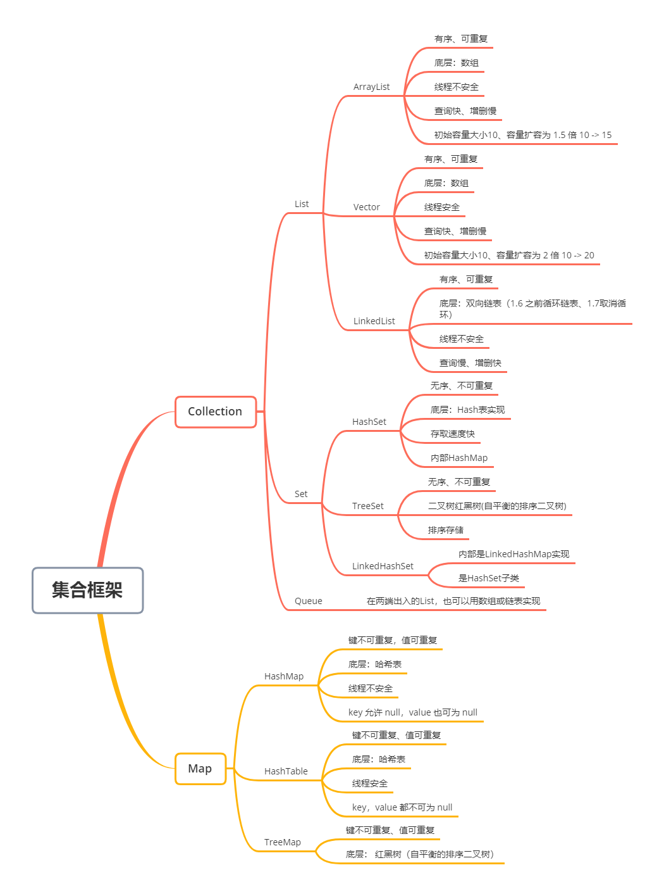

## 1 总览



### 1.1 List

- ArrayList： Object[]数组
- Vector：Object[]数组
- LinkedList： 双向链表，JDK1.6 之前为循环链表，JDK1.7 取消了循环

### 1.2 Set

- HashSet：无序，唯一的，底层采用  HashMap 来保存元素
- LinkedHashSet：LinkedHashSet 是  HashSet 的子类，其内部是通过  LinkedHashMap 来实现
- TreeSet：有序，唯一的，红黑树(自平衡的排序二叉树)

### 1.3 Map

- HashMap
  * JDK1.8之前 ：由数组 + 链表组成的，数组是 HashMap`的主体，链表则是主要为了解决哈希冲突而存在的（“拉链法”解决冲突）。
  * JDK1.8 以后：在解决哈希冲突时有了较大的变化，当链表长度大于阈值（默认为 8）（将链表转换成红黑树前会判断，如果当前数组的长度小于 64，那么会选择先进行数组扩容，而不是转换为红黑树）时，将链表转化为红黑树，以减少搜索时间。
- LinkedHashMap：继承自 HashMap，底层仍然是基于拉链式散列结构即由数组和链表或红黑树组成。另外，LinkedHashMap 在上面结构的基础上，增加了一条双向链表，使得上面的结构可以保持键值对的插入顺序。同时通过对链表进行相应的操作，实现了访问顺序相关逻辑。
- Hashtable： 数组 + 链表组成的，线程安全。
- TreeMap： 红黑树（自平衡的排序二叉树）。

## 2 List、Set、Map 区别？

- List：存储的元素是有序的、可重复的。
- Set: 存储的元素是无序的、不可重复的。
- Map: 使用键值对（kye-value）存储，Key 是无序的、不可重复的，value 是无序的、可重复的，每个键最多映射到一个值。

## 3 ArrayList 和 Vector 区别？

- ArrayList ：底层使用 Object[ ] 存储，适用于查找工作，线程不安全 ；
- Vector：底层使用 Object[ ] 存储，线程安全的。

## 4 ArrayList 和 LinkedList 区别？

* 底层数据结构不同：ArrayList  底层采用 Object 数组，LinkedList 底层采用 **双向链表**。
* 效率不同：ArrayList 查找快，插入和删除慢，LinkedList 查找慢，插入和删除快。
* 内存空间占用：ArrayList 主要空间开销在于需要在列表预留一定空间；而LinkedList主要空间开销在于需要存储结点信息以及结点指针信息。

## 5  HashSet、LinkedHashSet 和 TreeSet 区别？

* HashSet：是 Set  接口的主要实现类 ，底层是 HashMap，线程不安全的，可以存储 null 值；
* LinkedHashSet：HashSet的子类，能够按照添加的顺序遍历；
* TreeSet：底层使用红黑树，能够按照添加元素的顺序进行遍历，排序的方式有自然排序和定制排序；

## 6 HashMap 和 Hashtable 区别？

* 线程安全：HashMap 是非线程安全的，Hashtable 是线程安全的（基本被淘汰，不建议使用）。
* 对 Null key 和 Null value 的支持：HashMap 可以存储 null 的 key 和 value，但 null 作为键只能有一个，null 作为值可以有多个。HashTable 不允许有 null 键和 null 值，否则会抛出 NullPointerException。
* 容量
  * HashMap 默认的初始化大小为 16 ，每次扩充，容量变为原来的 2 倍，如果指定初始容量，将其扩充为 2 的幂次方大小。
  * Hashtable 默认的初始大小为 11，每次扩充，容量变为原来的 2n+1，如果指定初始容量，直接使用给定的大小。

* 底层数据结构：HashMap：JDK1.8 以后，当链表长度大于阈值（默认为 8）（将链表转换成红黑树前会判断，如果当前数组的长度小于 64，那么会选择先进行数组扩容，而不是转换为红黑树）时，将链表转化为红黑树，以减少搜索时间。Hashtable 没有这样的机制。

```java
    //使用 2 的幂次方作为哈希表的大小
    static final int tableSizeFor(int cap) {
        int n = cap - 1;
        n |= n >>> 1;
        n |= n >>> 2;
        n |= n >>> 4;
        n |= n >>> 8;
        n |= n >>> 16;
        return (n < 0) ? 1 : (n >= MAXIMUM_CAPACITY) ? MAXIMUM_CAPACITY : n + 1;
    }
```

## 7 HashMap 的长度为什么是 2 的幂次方？

HashMap 为了存取高效，要尽量较少碰撞，就是要尽量把数据分配均匀，每个链表长度大致相同，这个实现就在把数据存到哪个链表中的算法，这个算法实际就是取模，hash % length。计算机中直接求余效率不如**位移运算**，源码中做了优化 hash & (length-1)，**hash % length == hash & (length-1)** 的前提是 length 是 2 的 n 幂次方；

## 8 Comparable 和 Comparator 的区别？

### 8.1 Comparable(内部比较器) 

Comparable 是排序接口。若实现了 Comparable 接口，就意味着该类支持排序。实现了Comparable接口的类的对象的列表或数组可以通过Collections.sort或Arrays.sort进行自动排序。

```java
package java.lang;
import java.util.*;
public interface Comparable<T> {
    public int compareTo(T o);
}
```

### 8.2 Comparator(外部比较器)

Comparator 是比较接口，如果需要控制某个类的次序，而该类本身不支持排序(即没有实现Comparable接口)，那么就可以建立一个“该类的比较器”来进行排序，这个“比较器”只需要实现 Comparator 接口即可。可以通过实现Comparator 来新建一个比较器，然后通过这个比较器对类进行排序。该接口定义如下：

```java
package java.util;
public interface Comparator<T> {
    //负数:o1 < o2
    //零:o1 = o2
    //正数: o1 > o2
    int compare(T o1, T o2);
    boolean equals(Object obj);
}
```

## 9 ArrayList 扩容？

调用 grow() -> 初始化为 10 -> 1.5 倍 扩容

```java
private void grow(int minCapacity) {
        //oldCapacity:旧容量，newCapacity:新容量
        int oldCapacity = elementData.length;
        //将oldCapacity 右移一位，新容量更新为旧容量的 1.5 倍
        int newCapacity = oldCapacity + (oldCapacity >> 1);
        //检查新容量是否大于最小需求容量，若小于需求容量，新容量为最小需求容量
        if (newCapacity - minCapacity < 0)
            newCapacity = minCapacity;
        //检查新容量是否超出了最大容量，
        //超出,调用hugeCapacity()来比较minCapacity和 MAX_ARRAY_SIZE(Integer.MAX_VALUE - 8)
        //如果 minCapacity 大于MAX_ARRAY_SIZE，则新容量则为Interger.MAX_VALUE，否则，新容量大小则为 MAX_ARRAY_SIZE。
        if (newCapacity - MAX_ARRAY_SIZE > 0)
            newCapacity = hugeCapacity(minCapacity);
        elementData = Arrays.copyOf(elementData, newCapacity);
    }

    //比较 minCapacity 和 MAX_ARRAY_SIZE
    private static int hugeCapacity(int minCapacity) {
        if (minCapacity < 0) // overflow
            throw new OutOfMemoryError();
        return (minCapacity > MAX_ARRAY_SIZE) ?
            Integer.MAX_VALUE :
            MAX_ARRAY_SIZE;
    }


```

## 10 说说 ArrayList 源码中 ensureCapacity() 作用吧？

```java
    //增加此 ArrayList 实例的容量，确保可以容纳由minimum capacity参数指定的元素数。
    public void ensureCapacity(int minCapacity) {
        int minExpand = (elementData != DEFAULTCAPACITY_EMPTY_ELEMENTDATA)
            // any size if not default element table
            ? 0
            // larger than default for default empty table. It's already
            // supposed to be at default size.
            : DEFAULT_CAPACITY;

        if (minCapacity > minExpand) {
            ensureExplicitCapacity(minCapacity);
        }
    }
```

## 11 HashMap 底层实现

源码一定要仔细看一遍。

1.7：数组 + 链表

1.8 ：当链表长度大于阈值（默认为 8）（将链表转换成红黑树前会判断，如果当前数组的长度小于 64，那么会选择先进行数组扩容，而不是转换为红黑树）时，将链表转化为红黑树，以减少搜索时间。

## 12 ConcurentHashMap 底层实现

源码一定要仔细看一遍。

1.7：Segment 数组结构和 HashEntry 数组结构组成，Segment  继承 ReentrantLock。

1.8：取消了 Segment 分段锁，采用 **CAS 和 synchronized** 来保证并发安全。