## IM开发相关问题

[TOC]

### 一、如何保证消息不丢失不重复

刚接手IM办公软件的时候，遇到的第一个问题就是IM办公软件会丢失消息。作为一款即时通讯软件，丢失消息是一个很致命的问题。怎么解决呢？先看一下最简单的消息发送流程。client A发送消息给IM服务器，IM服务器再转发消息给client B。 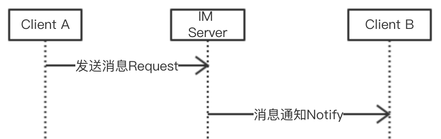

上述流程有个致命的问题，如果消息在发送过程中发生了丢失，既不知道消息有没有发生丢失，也不知道消息丢失发生在哪一个环节（是client A发送给IM服务器时候消息丢失还是IM服务器发送给client B时候发生消息丢失）。 如何确认消息有没有丢失，消息丢失发生在哪一个环节呢？可以通过应答机制来解决。client A发送消息给IM服务器，IM服务器收到消息后回复一个ack给client A, client A收到服务器发送的ack，client A就可以确定服务器收到了自己 发送的消息。如果没有收到服务器发送的ack，则不能确定服务器有没有收到自己发送的消息。这里存在两种可能，一种是client A发给服务器的时候，服务器没有收到消息；第二种是服务器收到消息了，发送ack给client A的后，client A没有收到ack。同理，服务器和Client B也是同样的流程，只是发送方成了IM 服务器，接收方成了client B。

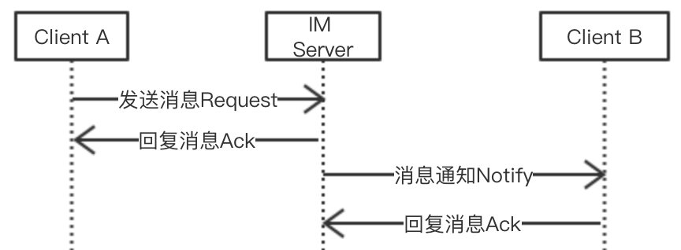

加入应答机制后，可以确定消息成功接收的情形，client A发送消息给服务器且收到了服务器回复的ack。但对于消息丢失的情形怎么处理呢？借鉴TCP的超时重传机制，如果client A在一定时间内没有收到IM服务器回复的ack，则超时重传。对应流程如下：

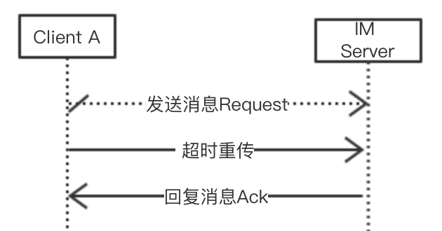

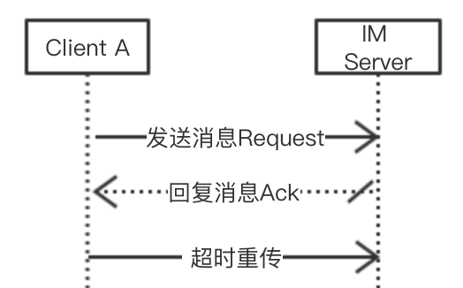

但加入超时重传机制后，我们发现接收端会接收到重复消息，重复消息对于IM来说，体验相当不好。通过过滤重复消息可以避免收到重复消息，这里需要对于发送的每一条消息，生成一个唯一的message ID。对于message ID的生成有几种方案，一种是使用UUID, 一种是由服务器统一生成，还用一种是发送方标识加一个递增的数字。UUID使用简单，但仅适合于用户量较少的情况，如果用户量过大，依然会发生碰撞。服务器统一生成的话，可以保证消息的唯一性，但美中不足的是会多一次网络交互。发送方标识加递增数字的话，可以保证message ID唯一性，但需要在用户切换设备时候，同步递增数字。据网上资料显示，微信使用的第三种方式。 结合上面流程和机制，我们得到一个完整的流程。client A发送消息给IM服务器，IM服务器收到消息后，根据message ID过滤重复并回复ack给client A。 client A如果没有收到IM服务器发送的ack，则重新发送此消息，IM 服务器收到消息后重复上面流程（IM服务器收到消息后，根据message ID过滤重复并回复ack给client A）。同理, IM服务器和client B也是同样流程。 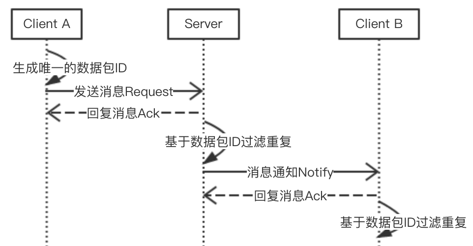

总结，保证消息不丢失不重复主要依赖于下述三个机制：

1. 应答机制，发送方发送消息，接收方收到消息后发送ack告诉发送方自己已收到消息。
2. 超时重传，发送方如果在一定时间内没有收到接收方发送的ack，则重新发送此消息。
3. 过滤重复，接收方在收到消息后，根据message ID过滤重复。

### 二、如何保证消息的及时性

对于即时通讯软件来说，面临的第二个问题是如何保证消息的及时性。

IM开发中，发送方client A发送消息给服务器，直接建立一个新的网络连接发送即可。但对于接收方client B从服务器获取消息，由于服务器本身不知道client B的IP地址，不能直接建立一个新的连接发送消息给接收方client B，因此有两种方式可以使接收方client B从服务器获取消息：1.接收方不断轮询从服务器拉取（早期web IM使用此方式，但由于费电费流量并不适合于移动端）2.接收方和服务器维持一个长连接，通过心跳包保持长连接，服务器推送消息给接收端(移动端IM包括微信、QQ大多采用此方案)。

了解上述背景后，其实如何保证消息的及时性，就变成了如何保证长连接的有效性以及长连接断开后及时重连，即长连接断开时候可以及时知道，在网络状况变化时候，及时建立新的长连接。

如何判断长连接有效性呢？长连接是否有效，只有发送方发送数据包（业务包和心跳包）给IM服务器，并收到IM服务器的回包，才能确定长连接是有效的。

在移动客户端，长连接断开的原因有多种，最常见的有NAT超时、网络从WIFI切换到移动数据或者网络从移动数据切换到WIFI、应用切换到后台不能上网（IOS和部分Android手机）、WIFI需要认证、应用长连接进程被杀死、偶尔因客户端或者服务端心跳包发送失败导致NAT超时等原因。对于NAT超时，需要客户端定期（定期间隔时间小于NAT超时时间）来发送心跳包来避免NAT超时，保证长连接可用。

如何及时建立长连接呢？结合上述原因，需在下面几种时机去通过发送心跳包去检测长连接的有效性，如果长连接断开，则重新建立新的长连接。
1.  网络状态发生变化（从WIFI切换到移动网络或从移动网络切换到WIFI）
2.  应用从后台切换回前台
3.  客户端发送心跳包（ping包）到服务器失败或者没有收到服务器对于心跳包的回包(pong包)
4.  客户端发送业务数据包到服务器失败或者没有收到服务器的回包。

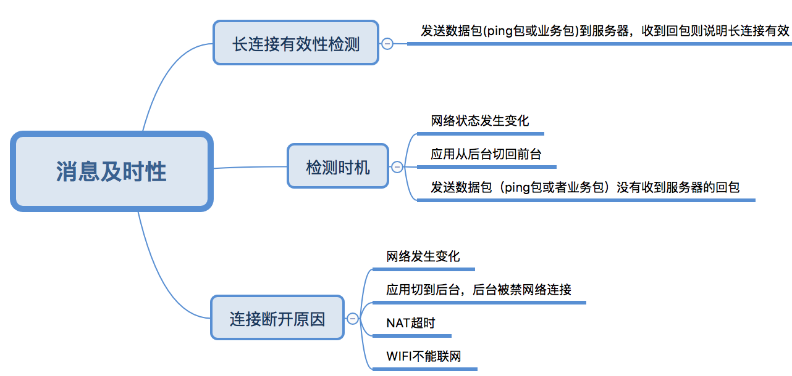

### 三、如何处理消息顺序

IM软件因为消息上下文的原因，因此需要保证消息的顺序。但是网络传输本身是无序的（即TCP/IP协议并不保证数据包接收的顺序），因此需要IM软件自己维护消息的顺序。通常的做法是在最终的接收端依据消息ID或者时间戳来做排序的。

一般有两种做法来维护消息的顺序：

1. 消息ID本身由发送方标识和发送方维护的递增数据来标识，直接用消息ID进行排序。
2. 每个消息都带有一个时间戳，接收方在收到消息时候，根据时间戳进行排序。

然而上述两种做法都存在不同的问题，使用第一种方案，利用发送方递增标识，对于单对单聊天没有问题，但无法保证群聊中消息的顺序。使用第二种方案的话，时间戳是按照发送方的时间戳还是IM服务器的时间戳，如果发送方（client A）的本地时间不准又该如何处理呢？

因为现在IM服务器一般都是使用集群的，每台机器的时钟并不能保证是一致的。因此要保证消息的顺序，对于单对单聊天可以采用第一种方案由发送方维护一个递增的顺序ID来标识，对于群聊则由系统生成一个递增的顺序ID，每次发送消息的时候带上顺序ID来保证消息的顺序。

### 四、离线消息的处理

IM软件中，经常遇到接收方不在线的时候，发送方发送了大量消息。接收方上线后收到大量的离线消息。如果客户端处理不当，极容易造成UI卡顿。

首先，我们看一下对于发送方和接收方同时在线的情况，发送方发送一条消息给IM服务器，IM服务器将消息存储后回复ack给发送方，再将消息推送给接收方，接收方将消息存储起来，并回复ack给IM服务器。发送方和接收方同时在线时，由于用户手动输入加上两次网络传输耗时要比接收方写入数据库加上刷新UI的耗时多，这样处理并没有问题。

对比双方同时在线情况，离线情况下接收方重新上线后，如果服务器和在线情况下同样处理，接收方会收到大量消息，如果服务器推送消息的速度过快，接收方由于接收消息存储数据库、数据处理和UI刷新，很容易出现卡顿。因此，有必要对此种情况进行处理。

对于离线消息的处理，一般采用客户端批量拉取离线消息的方式。接收方客户端client B从服务器请求一批消息（如50条），服务器返回一批消息给接收方客户端，接收方客户端将消息批量存储，回复ack给服务端并刷新UI。如果批量存储有任意一条失败，则认为批量存储失败，重新请求本批消息。接收方客户端回复ack给服务端后，则继续发起请求请求下一批数据。这里可以做一个优化，将接收方存储本批数据的ack和请求下一批数据的ack合并成一个请求。

对应流程图如下：

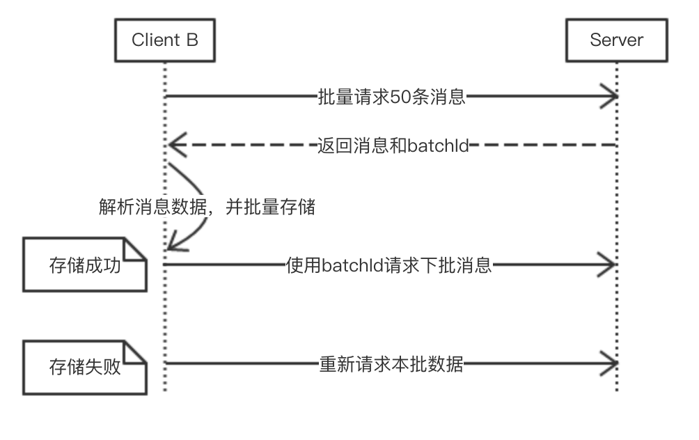

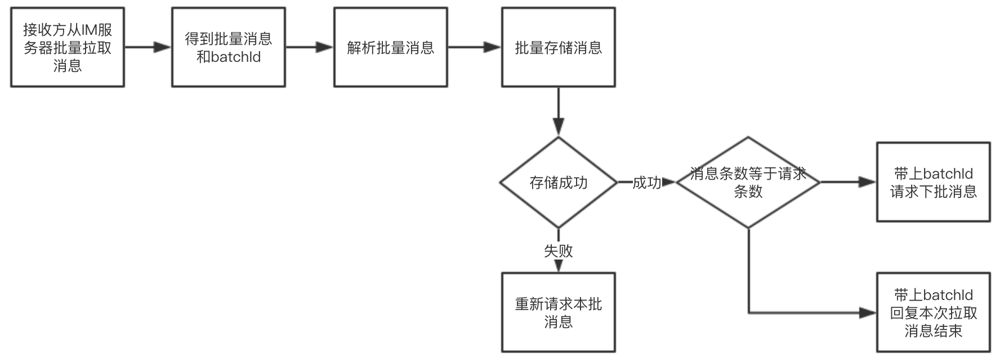

### 五、如何做到省电省流量

IM软件一方面因为登录时候数据量大，需要耗费大量流量和电量，数据不仅有在线消息（单对单聊天、群聊）、离线消息、文件、图片、视频，还有好友列表、群组列表、群友列表、好友详情、群组详情、群友详情等；另一方面因为IM软件要保证消息的及时性，需要在客户端维护一个长连接，长连接需要定时发送心跳包，本身也需要消耗流量和电量。因此有必须要对IM软件进行优化，做到尽可能省电省流量。

IM长连接方面主要的优化主要有以下几点：
1.  使用二进制协议（如Protobuffer）代替文本协议（XML、JSON）。关于Protobuffer与JSON、XML的对比，可以参考[这篇文章](https://developers.google.com/protocol-buffers/docs/overview)。
2.  心跳包发送间隔尽量接近NAT超时时间，如何使心跳包发送间隔接近NAT间隔，可以参考[一种Android端IM智能心跳算法的设计与实现探讨](http://www.52im.net/thread-783-1-1.html)。
3.  精简业务数据包和心跳包大小，比如将信令打平，使用int型数据代表信令接口名称。

IM登录时候主要的优化有以下几点：
1.  使用时间戳增量拉取数据，增量更新数据。
2.  延迟拉取数据，按需拉取数据。
3.  合并网络步骤。

下面使用一张图总结下IM优化流量电量要点

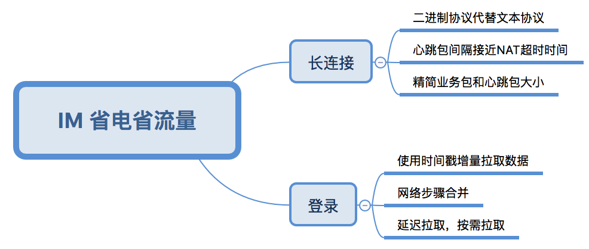

### 六、安全性

IM安全性主要包含传输安全、存储安全、权限控制等几个方面。

传输安全方面可以使用SSL加密、客户端校验服务端证书或者双向校验等方式。SSL本身利用了随机数、Diffie-Hellman或者公钥密码、对称密码等技术避免了绝大多数网络攻击，但无法防止中间人攻击。客户端校验服务器证书或者双向校验可以有效防止中间人攻击。

存储安全主要包含服务器存储安全和客户端存储安全。服务器存储安全要求服务器不要直接存储密码，改为[哈希加盐方式](http://blog.jobbole.com/61872/)，服务器生成token可以和设备关联起来 ，token有有效期或者在网络请求时候延长时间。客户端存储安全要求客户端不存储用户密码（即使加密存储也不行），改为加密存储token，对于其他数据也加密存储。

权限控制根据业务需要对不同用户进行不同的权限限制。

总结：

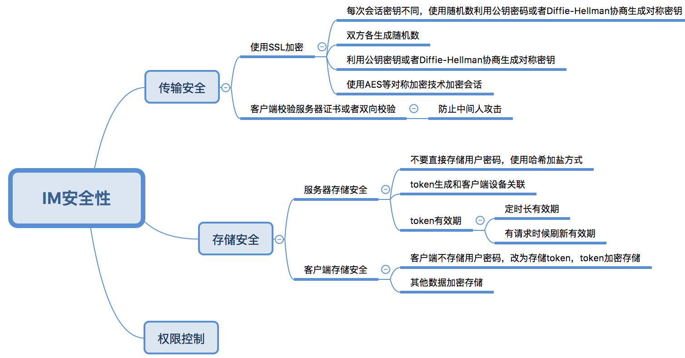

### 七、DNS问题

使用 TCP 时不可避免会碰到 DNS 解析的问题，毕竟我们不可能一直使用 IP 作为服务器地址。在 PC 时代，DNS 解析几乎不耗时。但进入无线时代后，DNS 相关问题越来越严重。一方面，在移动网络下，DNS 解析速度无比龟速，一次 DNS 解析的时间甚至能赶上一次 TCP 连接的时间，几秒，十几秒，甚至三，四十秒的请求时间都很常见。另一方面，由于运营商的不作为和作为，移动网络下 DNS 也呈现了解析准确度低和经常被劫持的状态。

针对DNS解析问题，一般采用内置默认IP列表和默认域名的方式。然后通过短连接或者长连接推送更新IP 列表。可以根据根据网络类型和运营商将IP分类，然后根据网络类型和运营商选择不同的IP，但这种需要能够准确获得网络类型和运营商。如果不能准确判断，反而不如随机选择，避免一台服务器压力过大。如果选择的IP连接不上，则换用其他IP，如果所有IP连接不上，则使用域名。

总结，对于DNS问题可以采用以下策略：
1.  客户端内置默认IP列表和域名；
2.  优先使用IP建立连接，如果所有IP失败，才使用域名；
3.  使用短连接和推送更新IP列表；
4.  如果可以准确获取网络类型和运营商，则根据网络类型和运营商选择IP。如果不行，则随机选择IP。如果连接成功，则记录连接成功IP。优先选择上次连接成功的IP。

### 八、长短链接在IM中的使用

IM软件中，常常使用长连接和短连接来处理很多业务。那么什么时候应该使用长连接，什么时候应该使用短连接呢？

一般情况下，使用短连接的地方都可以用长连接代替，但这样不利于解耦，而且对IM服务器的压力比较大，因此有必要合理使用长连接和短连接。

对于长连接使用场景，主要是消息透传和短时间内高频、较小数据量的数据交互以及推送。这样选择的原因有如下几点：

1.  服务器不知道客户端IP地址，如果是服务器发送给客户端的话，就需要保持一个长连接。
2.  建立一个短连接需要TCP 三次握手，在移动端TCP三次握手的时间也是挺可观的。
3.  维持一个长连接本身需要以小于NAT超时的间隔定时发送心跳包，需要耗费流量和电量。

其他场景则可以使用短连接。

一般现在移动客户端长短连接配合如下：
1.  短连接用途1：前置HTTP的SSO单点接口来实现身份认证；
2.  短连接用途2：集群式的IM中可能还会有独立（或集成于SSO单独登陆接口中）的SLB接口（即基于HTTP短连接拉取IM服务器集群IP列表）；
3.  短连接用途3：各种小文件的上传、下载接口实现（头像、图片、语音、文件等）都会是基于Http实现；
4.  短连接用途4：离线消息的批量拉取；
5.  短连接用户5：拉取好友详情、群组详情、群友详情等。
6.  长连接用途1：用户的实时上、下线状态通知；
7.  长连接用途2：实时的加友、加群等指令收发；
8.  长连接用途3：服务端发起的其它实时指令推送等。

### 九、文件传输

IM中文件传输分为单对单文件传输和群聊文件传输。文件传输的方式一般有两种，一种使用http方式，一种则是使用p2p方式传输文件。那么两种方式应该如何选择呢？

首先，我们看一下两种传输方式的优缺点。

http文件传输方式优点如下：

1.  支持离线方式，发送方上传完文件，接收方上线后可以随时下载；
2.  对于群聊中文件传输，发送方只需要上传一次即可；
3.  服务器存储文件，可以进行有效控制，对于过滤不良信息有所帮助；
4.  http协议本身支持断点续传和断点下载，对于上传和下载中断情况可以很好处理。
5.  便于用户分享;

http 文件传输方式缺点：

1.  服务器需要存储文件，增加了运营服务器的成本；
2.  文件经过服务器，会增加服务器的流量消耗；
3.  文件传输经过服务器，私密文件安全性风险增加；

p2p方式传输优点：
1.  服务器无需存储文件，减少了文件存储的成本；
2.  文件不经过服务器，减少了服务器的流量消耗；
3.  文件传输不经过服务器，私密文件安全性更高；

p2p方式传输缺点：
1.  需要发送方和接收方同时在线，用户使用不方便。
2.  对于群聊中文件传输，发送方需要传输多次，发送方流量消耗增加；
3.  无法进行对不良消息的过滤；
4.  p2p 文件传输需要建立p2p连接，p2p连接建立有可能失败。
5.  p2p协议本身不支持文件断点续传和断点下载，如果需要实现文件断点续传和断点下载比较复杂。
6.  不利于用户分享；

结合单对单文件传输和群聊文件传输使用场景以及两种传输方式的优缺点，现在IM发送文件大多采用http方式，对应流程如下：

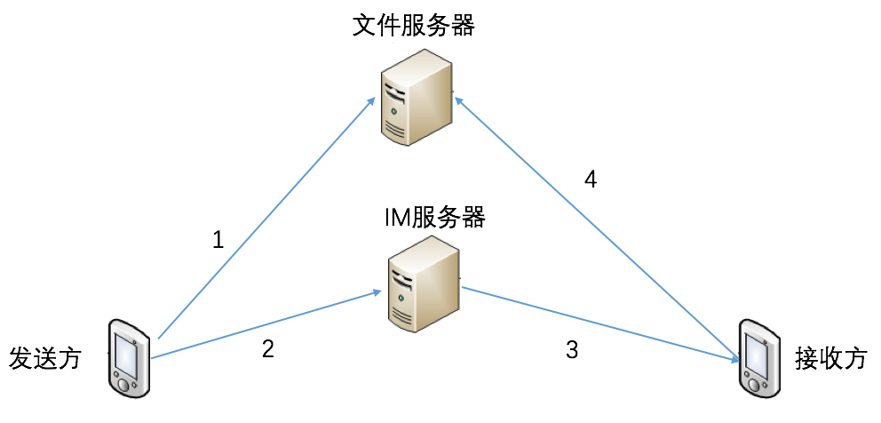

1.  发送方上传文件到文件服务器得到文件url；
2.  发送方将文件url和文件信息发送给IM服务器；
3.  IM服务器将文件url和文件信息推送给接收方；
4.  接收方使用文件url从文件服务器下载url；

对于图片、音频、视频等和普通文件传输方式一样，只是显示不同，另外图片和视频需要生成缩略图，将缩略图也传输给接收方。